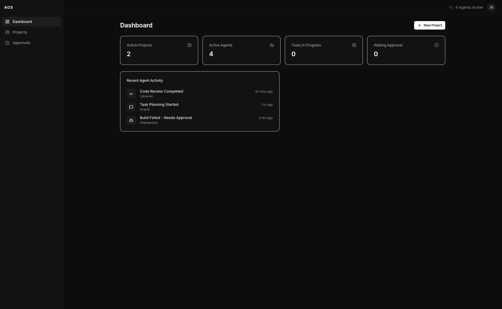
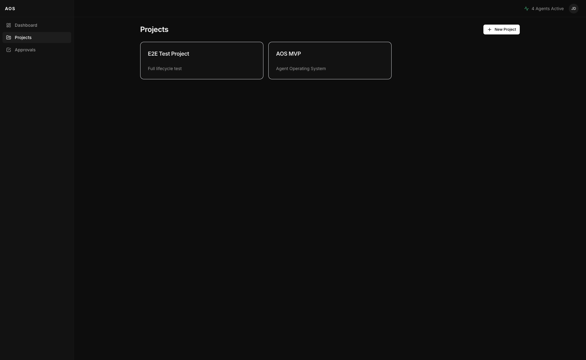
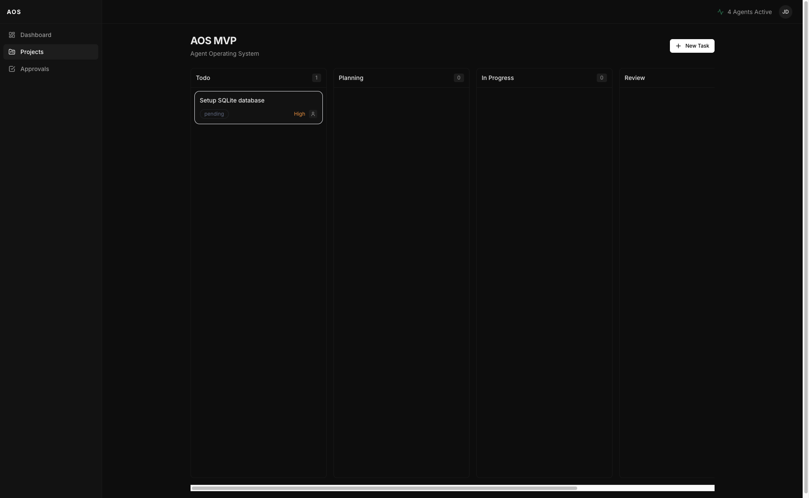
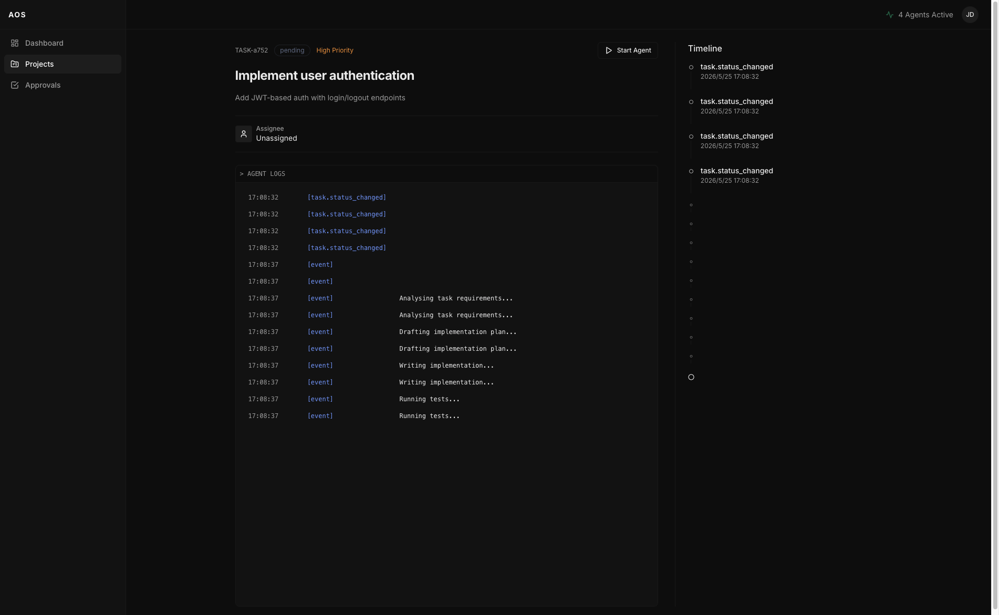
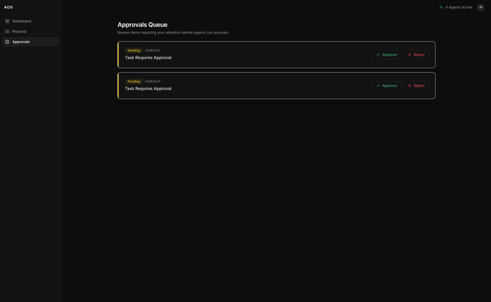

# OpenTask

**把 AI Agent 接入你的工程任务流。**

OpenTask 是一个轻量级的任务管理系统，专为 AI Agent 协作而设计。你在界面上创建任务、点击启动，Agent 就会自动接管并开始执行 —— 完成后回来等你审批，你说行它才算完。



---

## 它解决什么问题

传统任务管理工具是给人用的。你分配任务、人去做、回来汇报。

OpenTask 的对象是 Agent。你描述任务，Agent 去做，做完找你确认。人始终是最后一道关卡，但过程里不需要盯着它。

```
你创建任务  →  启动 Agent  →  Agent 自主执行  →  Agent 请求审批  →  你审批 → 完成
```

---

## 界面预览

### Dashboard — 一览全局


### Projects — 项目列表



### 任务看板



### Agent 执行日志 — 实时追踪每一步



### Approvals — 你的最终决定

Agent 完成后，任务进入审批队列。你决定是否通过。



---

## 快速上手

**前置条件**: Node.js 18+

```bash
# 1. 启动后端
cd api
npm install
npm run start:dev
# 运行在 http://localhost:3001

# 2. 启动前端（新终端）
cd web
npm install
npm run dev
# 打开 http://localhost:3000
```

打开浏览器，你会看到一个空的 Dashboard。

---

## 如何使用

### 第一步：创建项目

进入 **Projects** 页面 → 点击 **New Project** → 填写名称。

### 第二步：创建任务

在项目内点 **New Task**，填写：
- **Title**：任务标题，越清晰越好（Agent 直接根据这个执行）
- **Description**：补充上下文，说明期望的结果、约束条件等

### 第三步：启动 Agent

任务创建后状态是 `pending`。点击任务 → **Start Agent**。

任务状态会依次变化：
```
pending → planning → in_progress → waiting_approval
```

你可以在任务详情页实时看到 Agent 的执行日志（它在想什么、在写什么）。

### 第四步：审批

Agent 完成后，任务进入 `waiting_approval` 状态，同时出现在 **Approvals** 页面。

你可以：
- **Approve** — 任务标记为 `completed`
- **Reject** — 任务回退，重新处理

---

## 与 OpenCode / OpenAgent 配合

OpenTask 本身是任务调度层，真正执行任务的是 **[OpenCode](https://github.com/sst/opencode)**（即 oh-my-openagent 底层所使用的 AI 编码引擎）。

### 连接方式

**1. 启动 OpenCode 服务**

```bash
# 安装 opencode（如果还没安装）
npm install -g opencode-ai

# 在你的代码仓库目录启动 OpenCode server
cd /your/project
opencode serve --port 4096
```

**2. 告诉 OpenTask 去哪找它**

在 `api/.env` 里设置：

```env
OPENCODE_URL=http://127.0.0.1:4096
```

重启后端即生效。

**3. 创建任务并指定工作目录**

在任务描述里加上工作路径，Agent 就知道在哪个仓库里操作：

> "实现用户登录接口，使用 JWT，参考 `src/auth` 现有代码结构。Working directory: /your/project"

**4. 观察执行**

OpenTask 会实时接收 OpenCode 发出的事件流（SSE），并展示在任务日志里。你能看到 Agent 在分析、规划、写代码、跑测试的全过程。

### 没有 OpenCode 也能用

如果 `OPENCODE_URL` 没有配置或服务未启动，OpenTask 会自动进入 **Stub 模式**：模拟一个 7 秒的 Agent 执行过程（thinking → planning → coding → testing → completed），方便你先跑通流程、测试界面。

---

## 任务状态说明

| 状态 | 含义 |
|------|------|
| `pending` | 任务已创建，等待启动 |
| `planning` | Agent 正在分析任务 |
| `in_progress` | Agent 执行中 |
| `waiting_approval` | Agent 完成，等待你审批 |
| `blocked` | 遇到阻塞，需要人工介入 |
| `completed` | 已审批通过 |
| `failed` | 执行失败 |

---

## 环境变量

**`api/.env`**
```env
OPENCODE_URL=http://127.0.0.1:4096   # OpenCode 服务地址
PORT=3001                              # API 端口
DATABASE_URL=                          # PostgreSQL（不填则用 SQLite）
```

**`web/.env.local`**
```env
NEXT_PUBLIC_API_URL=http://localhost:3001/api/v1
NEXT_PUBLIC_WS_URL=http://localhost:3001
```

---

## License

MIT
